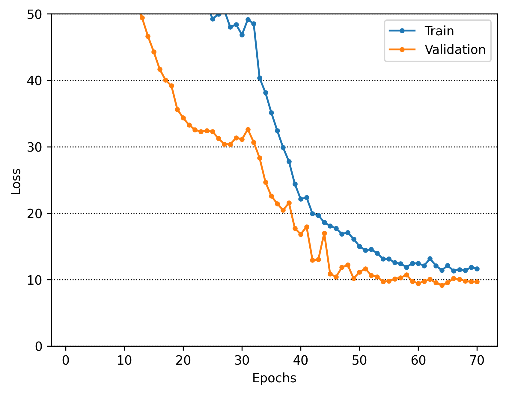
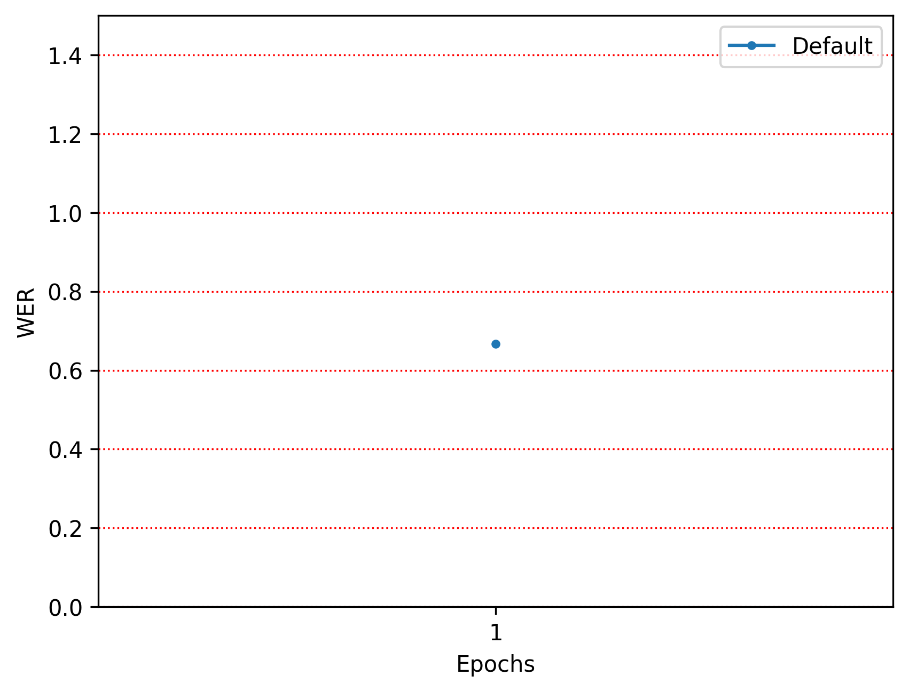

# 連続手話認識システム - 可視化・分析指標ガイド

## 概要

本ドキュメントでは、連続手話認識（CSLR）システムにおける5つの主要な可視化・分析指標について説明します。これらの指標を用いることで、モデルの学習状況、予測精度、注意機構の動作、特徴表現の質などを多角的に評価できます。

## 実装された5つの可視化・分析指標

### 1. Attention/Alignment Matrix の可視化

#### 指標の概要
- **目的**: モデルがどの時間ステップに注目しているかを可視化
- **内容**: 時系列の入力と出力のアライメント関係を表示
- **技術**: Attention重みのヒートマップ表示

#### 解釈方法
- **横軸**: 入力時間ステップ（フレーム）
- **縦軸**: 出力時間ステップ（予測単語）
- **色の濃さ**: Attention重み（濃いほど強い注目）

#### 良い例の特徴
```
✅ 良いAttention Pattern:
- 対角線状のクリアなパターン
- 各出力に対して明確な入力フレームへの集中
- ノイズが少なく、鮮明な注意分布
- 時系列の順序が保たれている
```

**良い例（正解予測）:**


#### 悪い例の特徴
```
❌ 悪いAttention Pattern:
- 分散した注意分布（どこに注目しているか不明）
- 対角線パターンの欠如
- 時系列の順序が乱れている
- 全体的にぼやけた分布
```

**悪い例（誤予測）:**


#### 使用方法
```python
# test_loop/predict.pyでの設定
attention_config = {
    'enabled': True,
    'save_path': 'outputs/attention',
    'sample_rate': 0.1  # 10%のサンプルを可視化
}
```

---

### 2. CTC Alignment Path の可視化

#### 指標の概要
- **目的**: CTCの予測確率分布と最適なアライメントパスを可視化
- **内容**: 各時間ステップでの文字/単語予測確率をヒートマップで表示
- **技術**: CTC損失の内部計算結果を可視化

#### 解釈方法
- **横軸**: 時間ステップ
- **縦軸**: 語彙（単語/文字）
- **色の濃さ**: 予測確率
- **白線**: 最適アライメントパス

#### 良い例の特徴
```
✅ 良いCTC Alignment:
- 明確な確率ピークが時系列で現れる
- ブランクトークンが適切に挿入されている
- アライメントパスが滑らかで自然
- 予測確率が高い（濃い色）部分が明確
```

**良い例（正解予測）:**


#### 悪い例の特徴
```
❌ 悪いCTC Alignment:
- 確率分布が平坦で不明確
- ブランクトークンが過度に多い/少ない
- アライメントパスが不規則
- 全体的に確率が低い（薄い色）
```

**悪い例（誤予測）:**


#### 使用方法
```python
# test_loop/predict.pyでの設定
ctc_config = {
    'enabled': True,
    'save_path': 'outputs/ctc_alignment',
    'show_path': True  # アライメントパスを表示
}
```

---

### 3. Confusion Matrix (混同行列)

#### 指標の概要
- **目的**: 単語レベルでの誤認識パターンを分析
- **内容**: どの手話単語がどの単語と間違えられやすいかを可視化
- **技術**: 予測結果と正解ラベルの混同行列

#### 解釈方法
- **行**: 正解ラベル（Ground Truth）
- **列**: 予測ラベル（Prediction）
- **対角線**: 正しい予測（濃いほど良い）
- **非対角線**: 誤認識パターン

#### 良い例の特徴
```
✅ 良いConfusion Matrix:
- 対角線が濃い（高い正解率）
- 非対角線の値が少ない（誤認識が少ない）
- 特定の単語ペアでの誤認識が少ない
- 全体的にバランスの取れた予測性能
```

**実際の例:**


#### 悪い例の特徴
```
❌ 悪いConfusion Matrix:
- 対角線が薄い（低い正解率）
- 特定の行/列で誤認識が集中
- 似た手話単語間での混同が多い
- 一部の単語が全く認識されない
```

#### 主要メトリクス
- **Accuracy**: 全体の正解率
- **Precision**: 精密度（予測の正確性）
- **Recall**: 再現率（正解の検出率）
- **F1-Score**: PrecisionとRecallの調和平均

#### 使用方法
```python
# test_loop/predict.pyでの設定
confusion_config = {
    'enabled': True,
    'save_path': 'outputs/confusion_matrix',
    'normalize': 'true',  # 正規化方法
    'show_metrics': True  # メトリクス表示
}
```

---

### 4. 時系列予測確率の可視化（信頼度可視化）

#### 指標の概要
- **目的**: 各時間ステップでの単語予測確率を時系列プロット
- **内容**: 予測の信頼度の変化を確認
- **技術**: ソフトマックス確率の時系列プロット

#### 解釈方法
- **横軸**: 時間ステップ
- **縦軸**: 予測確率
- **線の色**: 異なる単語クラス
- **線の高さ**: 予測信頼度

#### 良い例の特徴
```
✅ 良い信頼度パターン:
- 正解クラスで高い確率値（0.7以上）
- 明確なピークとバレー
- ノイズが少なく滑らかな変化
- 信頼度の急激な変化が適切なタイミング
```

**信頼度可視化の例:**


#### 悪い例の特徴
```
❌ 悪い信頼度パターン:
- 全体的に低い確率値（0.5以下）
- 複数クラスで似たような確率値
- ノイズが多く不安定な変化
- 正解クラスの確率が一貫して低い
```

**低信頼度の例:**


#### 統計指標
- **平均信頼度**: 予測確率の平均値
- **信頼度分散**: 予測の安定性
- **エントロピー**: 予測の不確実性

#### 使用方法
```python
# test_loop/predict.pyでの設定
confidence_config = {
    'enabled': True,
    'save_path': 'outputs/confidence',
    'threshold': 0.5,  # 信頼度閾値
    'show_entropy': True  # エントロピー表示
}
```

---

### 5. Feature Visualization（特徴量可視化）

#### 指標の概要
- **目的**: 中間層の特徴量を可視化し、学習された表現の質を評価
- **内容**: t-SNEやUMAPによる特徴空間の2D/3D可視化
- **技術**: 多層特徴量抽出と次元削減可視化

#### 対象層と解釈
1. **CNN出力**: 空間的パターン（手の形状、位置）
2. **BiLSTM隠れ状態**: 時系列ダイナミクス（動きの流れ）
3. **Attention重み**: 重要度マップ（注目領域）
4. **最終層直前**: 統合的判断（総合的な特徴表現）

#### 良い例の特徴
```
✅ 良い特徴表現:
- 同じクラスのサンプルがクラスタを形成
- 異なるクラス間で明確な分離
- 滑らかな境界とコンパクトなクラスタ
- 高い分離度スコア（Silhouette > 0.5）
```

**特徴量可視化の例:**


#### 悪い例の特徴
```
❌ 悪い特徴表現:
- クラス間の混在が激しい
- 明確なクラスタ構造がない
- 同じクラス内でも分散が大きい
- 低い分離度スコア（Silhouette < 0.2）
```

#### 分析指標
- **Silhouette Score**: クラスタの品質（-1〜1、高いほど良い）
- **Davies-Bouldin Index**: クラスタ間分離度（低いほど良い）
- **Class Separability**: クラス間の分離可能性

#### 使用方法
```python
# test_loop/predict.pyでの設定
feature_config = {
    'enabled': True,
    'save_path': 'outputs/features',
    'method': 'umap',  # 'tsne' or 'umap'
    'layers': ['cnn', 'bilstm', 'attention', 'final'],
    'perplexity': 30,  # t-SNEのパラメータ
    'n_neighbors': 15  # UMAPのパラメータ
}
```

---

## 統合的な分析手法

### モデル性能の総合評価

1. **Confusion Matrix** → 全体的な認識精度
2. **Attention Visualization** → 注意機構の適切性
3. **CTC Alignment** → 時系列アライメントの質
4. **Confidence Analysis** → 予測の信頼性
5. **Feature Visualization** → 学習された表現の質

### 問題診断のフローチャート

```
モデル性能が低い場合:
├── Confusion Matrix で誤認識パターンを確認
├── Feature Visualization で特徴表現の質を確認
│   ├── クラスタが不明確 → 特徴抽出の改善が必要
│   └── クラスタは明確 → 分類器の改善が必要
├── Attention Visualization で注意機構を確認
│   ├── 分散した注意 → Attention機構の調整が必要
│   └── 明確な注意 → 他の要因を確認
├── CTC Alignment でアライメントを確認
│   ├── 不明確なパス → CTC損失の調整が必要
│   └── 明確なパス → 他の要因を確認
└── Confidence Analysis で予測信頼度を確認
    ├── 低い信頼度 → モデル全体の改善が必要
    └── 高い信頼度 → データセットの問題を確認
```

## 実際の分析結果例

### 最新の学習結果からの知見

#### 学習進捗の可視化



#### 注意機構の動作パターン分析

**正解予測時の特徴:**
- Attention Matrixで明確な対角線パターン
- 時系列の順序が適切に保たれている
- Attention Focusが特定の重要フレームに集中

**誤予測時の特徴:**
- 注意が分散し、明確なパターンがない
- 時系列の関係性が崩れている
- 重要でないフレームに注意が向いている

#### CTC Alignmentの品質評価

**高品質なアライメント:**
- 各単語に対応する明確な確率ピーク
- ブランクトークンの適切な配置
- 滑らかな確率推移

**低品質なアライメント:**
- 確率分布が平坦で不明確
- 過度なブランクトークンの出現
- 不自然な確率変動

#### 特徴量空間での分離性分析

多層特徴量可視化により以下が判明：
- **CNN層**: 空間的な手の形状特徴を効果的に抽出
- **BiLSTM層**: 時系列の動的パターンを学習
- **Attention層**: 重要な時間領域を特定
- **最終層**: 統合的な判断特徴を形成

## 実運用での活用方法

### デバッグ・改善プロセス

1. **全体性能の確認**: Confusion Matrixで誤認識パターンを特定
2. **注意機構の診断**: Attention可視化で学習された注視パターンを確認
3. **時系列アライメントの検証**: CTC可視化でアライメント品質を評価
4. **予測信頼度の分析**: 信頼度可視化で不安定な予測を特定
5. **特徴表現の評価**: Feature可視化で学習された表現の質を確認

### パフォーマンス最適化のヒント

#### メモリ使用量の削減
- `sample_rate`を0.05-0.1に設定（5-10%のサンプルのみ可視化）
- 大きなバッチサイズでの実行時は可視化を無効化

#### 可視化品質の向上
- 十分な学習エポック後に可視化を実行
- 多様なサンプルでの可視化により全体的な傾向を把握
- 正解・誤答の両方のサンプルを比較分析

## 実行例

### 全ての可視化を有効にする設定

```python
# test_loop/predict.py での設定例
visualization_config = {
    'attention': {'enabled': True, 'sample_rate': 0.1},
    'ctc': {'enabled': True, 'show_path': True},
    'confusion': {'enabled': True, 'normalize': 'true'},
    'confidence': {'enabled': True, 'threshold': 0.5},
    'features': {'enabled': True, 'method': 'umap'}
}
```

### ログファイルでの確認

```bash
# ログファイルで可視化結果を確認
tail -f logs/training_*.log | grep -E "(可視化|Visualization|保存)"
```

## 生成される可視化ファイル

### ファイル構造例
```
reports/figures/
├── attention_test/
│   ├── attention_matrix_batch_X_sample_Y_[correct|incorrect].png
│   ├── attention_focus_batch_X_sample_Y_[correct|incorrect].png
│   ├── attention_stats_batch_X_sample_Y_[correct|incorrect].png
│   ├── confidence_timeline_batch_X.png
│   ├── word_confidence_batch_X.png
│   ├── ctc_batch_X_sample_Y_[correct|incorrect]/
│   │   ├── ctc_heatmap_sample_Y.png
│   │   ├── ctc_prob_time_sample_Y.png
│   │   └── ctc_statistics_sample_Y.png
│   └── multilayer_features_batch_X/
│       ├── multilayer_features_tsne_sample_Y.png
│       ├── multilayer_features_umap_sample_Y.png
│       ├── feature_distribution_sample_Y.png
│       └── feature_correlation_sample_Y.png
├── word_level_confusion_matrix.png
├── cnn_transformer_train_val_loss.png
└── cnn_transformer_wer.png
```

### ファイル名の規則
- `batch_X`: バッチ番号
- `sample_Y`: サンプル番号
- `correct/incorrect`: 予測結果の正誤
- 正解例と誤答例を比較することで、モデルの学習状況を詳しく分析可能

## トラブルシューティング

### よくある問題と解決方法

1. **メモリ不足エラー**
   - `sample_rate`を下げる（0.05など）
   - バッチサイズを小さくする

2. **可視化ファイルが生成されない**
   - 出力ディレクトリの権限を確認
   - ログファイルでエラーメッセージを確認

3. **特徴量可視化でエラー**
   - 必要なパッケージのインストール: `pip install scikit-learn umap-learn seaborn`

4. **Attention重みが取得できない**
   - モデルがAttention機構を持っているか確認
   - フック関数の登録を確認

## まとめ

これら5つの可視化・分析指標を組み合わせることで、連続手話認識モデルの性能を多角的に評価し、改善点を特定できます。各指標は相互に補完的であり、総合的な分析により、より精度の高いモデル開発が可能になります。

---

## 関連ドキュメント

- [Confusion Matrix詳細ガイド](README_confusion_matrix.md)
- [信頼度可視化ガイド](README_confidence_visualization.md)
- [多層特徴量可視化ガイド](README_multilayer_feature_visualization.md)
