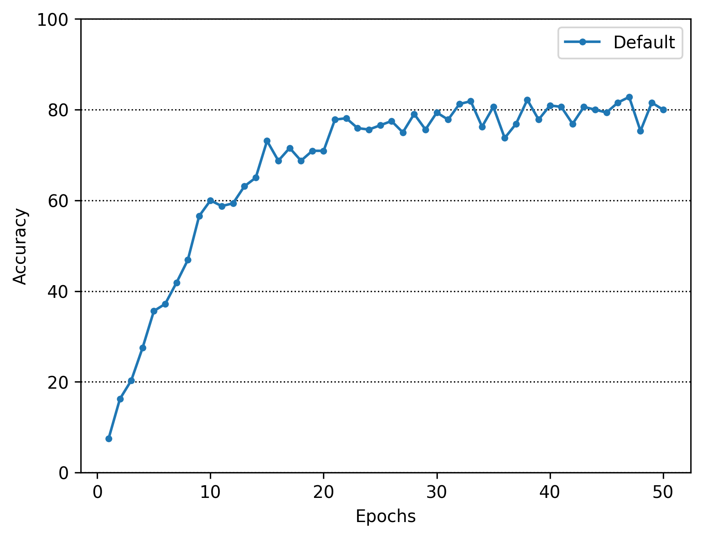

# handLanguageTranslation
手話翻訳の研究

## リポジトリの内容
手話はろう者が使用する直接的なコミュ二ケーション手段である．健聴者が日常会話の手話を習得するには約3年必要とされており，手話の自動翻訳が望まれている．そのため、動画内に一つの手話単語が存在する孤立手話単語認識及び動画内に複数の手話単語が存在する連続手話単語認識を行っている

## 実行コマンド
```bash
docker compose up
```
但し、csv_to_hdf5, movie_to_csv, relation_asl_signについては動画の前処理のため自分で環境を設定して下さい

また、認識の実験を行いたい場合、hdf5を自分で作成して下さい

もし実験的にすぐ使い方は、[リンク](https://drive.google.com/file/d/1mQGin0n8W86VYyUIcAdARdt1zrZ4PWDo/view?usp=sharing)からファイルをダウンロードして以下のようなファイル構成にして動かして下さい。各ファイルに詳しい実行コマンドが書いてあります。

## ファイル構成
<pre>
handLanguageTranslation/
├── IsolatedSignLanguage #孤立手話単語認識関連
│   ├── cnn
│   ├── conformer
│   └── transformer
├── csv　csvの格納場所
│   └── nhk
├── csv_to_hdf5　csvからhdf5に変換するコード
│   └── src
├── data 動画の格納場所
│   ├── LSA64
│   ├── asl-signs
│   ├── dataset_top10
│   ├── gislr_dataset_top10.zip
│   ├── nhk
│   └── 東海支部DB
├── docker
│   ├── Dockerfile
│   └── requirements.txt
├── docker-compose.yml
├── Interpolation #MediaPipeの補間方法
│   ├── linear_interpolation #線形補間
│   └── kalman_filter #カルマンフィルタ
├── README.md
├── hdf5 hdf5ファイルの格納場所
│   └── nhk
├── movie_to_csv 動画からcsvに変換するコード
│   └── src
└── relation_asl_sign　aslのデータ関連
    └── src
</pre>

## 実験結果
### Transformerの結果

Lossの結果


Test結果


最終結果が85.3%
