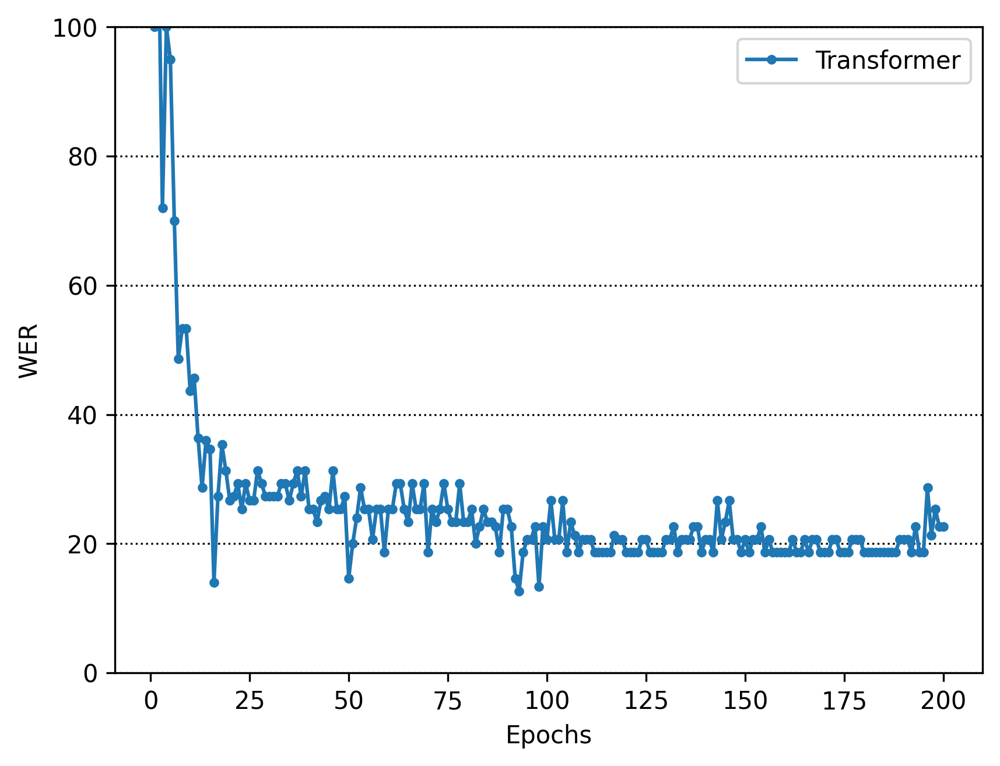

# handLanguageTranslation
手話翻訳の研究

## リポジトリの内容
手話はろう者が使用する直接的なコミュ二ケーション手段である．健聴者が日常会話の手話を習得するには約3年必要とされており，手話の自動翻訳が望まれている．そのため、動画内に一つの手話単語が存在する孤立手話単語認識及び動画内に複数の手話単語が存在する連続手話単語認識を行っている

## 実行コマンド
```bash
docker compose up
```
但し、csv_to_hdf5, movie_to_csv, relation_asl_signについては動画の前処理のため自分で環境を設定して下さい

また、認識の実験を行いたい場合、hdf5を自分で作成して下さい

もし実験的にすぐ使い方で孤立手話単語認識の場合は、[リンク](https://drive.google.com/file/d/1mQGin0n8W86VYyUIcAdARdt1zrZ4PWDo/view?usp=sharing)からファイルをダウンロードして以下のようなファイル構成にして動かして下さい。各ファイルに詳しい実行コマンドが書いてあります。

## ファイル構成
<pre>
handLanguageTranslation/
├── ContinuousSignLanguage #連続手話単語認識関連
│   ├── cnn　未実装
│   ├── conformer 未実装
│   └── transformer
├── IsolatedSignLanguage #孤立手話単語認識関連
│   ├── cnn 未実装
│   ├── conformer 未実装
│   └── transformer
├── csv　csvの格納場所
│   └── nhk
├── csv_to_hdf5　csvからhdf5に変換するコード
│   └── src
├── data 動画の格納場所
│   ├── LSA64
│   ├── asl-signs
│   ├── dataset_top10
│   ├── gislr_dataset_top10.zip
│   ├── nhk
│   └── 東海支部DB
├── docker
│   ├── Dockerfile
│   └── requirements.txt
├── docker-compose.yml
├── Interpolation #MediaPipeの補間方法
│   ├── linear_interpolation #線形補間
│   └── kalman_filter #カルマンフィルタ
├── README.md
├── hdf5 hdf5ファイルの格納場所
│   └── nhk
├── movie_to_csv 動画からcsvに変換するコード
│   └── src
└── relation_asl_sign　aslのデータ関連
    └── src
</pre>

## 実験結果
### 孤立手話単語認識

#### データセットの内容
データセットはLSA64を使用して行った。LSA64は、10人の非専門家が64種類の手話を5回繰り返して実行した合計3,200本のアルゼンチ手話データセットである。LSA64のデータセットをtrain: 8, val: 1, test: 1の人数比率で実験を行った。実験のデータの比率も同様である。
LSA64からMediaPipeで骨格座標を取得し、その後線形補間を行い相対座標にした。取得した相対座標がモデルに入力するデータである。


#### Lossの結果


#### Test結果


最終結果 91.6%

### 連続手話単語認識

#### データセット内容
[ここ](https://takayama-rado.com/articles/gasl_1.html)に詳しく書いてあります。
現状連続手話単単語データセットはあまりないので連続指文字のデータセットで行った。

#### Lossの結果


#### Test結果


WER率 70%

WER（Word Error Rate、単語誤り率）は、音声認識や機械翻訳などの自然言語処理システムの性能を評価するためによく使用される指標。WERは、システムが出力した文（仮説文）と正しい文（参照文）との間で発生した単語の置換（Substitutions）、削除（Deletions）、挿入（Insertions）の総数を基に計算される。


## コミットメッセージの規約
<pre>
fix：バグ修正
hotfix：クリティカルなバグ修正
add：新規（ファイル）機能追加
update：機能修正（バグではない）
change：仕様変更
clean：整理（リファクタリング等）
disable：無効化（コメントアウト等）
remove：削除（ファイル）
upgrade：バージョンアップ
revert：変更取り消し
chore: それ以外
</pre>
2024年10月31日から